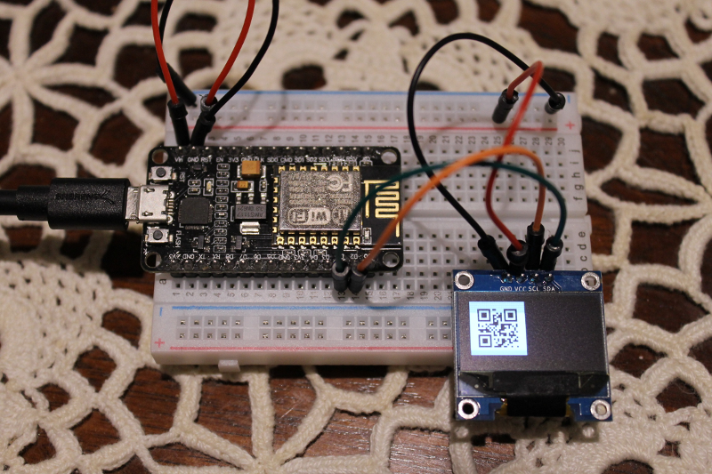

# uQR

A QR code library for MicroPython.

## About

This library is a fork of [python-qrcode](https://github.com/lincolnloop/python-qrcode) that has been ported to [MicroPython](https://micropython.org/).

The primary *interface* implication of MicroPython compatibility is that this library does not produce images. It only produces bitmap-style matrices: you encode your data into a QR code pixel matrix using this library, and then impose that matrix onto a frame buffer.

This library *does work*. But generating a QR code requires a fair amount of code and memory: not all microprocessors will be able to use this library. For example, I was not able to use this library on an ESP8266 using the file upload method: I would run out of memory when I imported the library. I *was* able to use this library when I compiled it into a MicroPython binary--following [AdaFruit's instructions](https://learn.adafruit.com/building-and-running-micropython-on-the-esp8266/build-firmware)--but I was only able to encode small amounts of data: I ran out of memory while trying to encode larger QR codes.

Porting the `python-qrcode` library to MicroPython involved:

  1. Removing libraries unavailable in MicroPython.
  2. Rewriting syntax that is unavailable in MicroPython.
  3. Removing Py2/Py3 cross-compatibility code.
  4. Removing QR code image generation.
  5. Rewriting recursive function calls into loops: MicroPython has a much shallower recursion limit than CPython.
  6. Consolidating all of the code into one file, for easier MicroPython deployment.

## Example

```
  >>> from uQR import QRCode
  >>> qr = QRCode()
  >>> qr.add_data('uQR rocks!')
  >>> matrix = qr.get_matrix()
```

The variable `matrix` is now a two-dimensional list of booleans, representing a bitmap of the required QR code. Specifically, it has the value:

```
  [
    [False, False, False, False, False, False, False, False, False, False, False, False, False, False, False, False, False, False, False, False, False, False, False, False, False, False, False, False, False],
    [False, False, False, False, False, False, False, False, False, False, False, False, False, False, False, False, False, False, False, False, False, False, False, False, False, False, False, False, False],
    [False, False, False, False, False, False, False, False, False, False, False, False, False, False, False, False, False, False, False, False, False, False, False, False, False, False, False, False, False],
    [False, False, False, False, False, False, False, False, False, False, False, False, False, False, False, False, False, False, False, False, False, False, False, False, False, False, False, False, False],
    [False, False, False, False, True, True, True, True, True, True, True, False, True, True, False, False, False, False, True, True, True, True, True, True, True, False, False, False, False],
    [False, False, False, False, True, False, False, False, False, False, True, False, False, False, False, False, False, False, True, False, False, False, False, False, True, False, False, False, False],
    [False, False, False, False, True, False, True, True, True, False, True, False, False, False, True, False, True, False, True, False, True, True, True, False, True, False, False, False, False],
    [False, False, False, False, True, False, True, True, True, False, True, False, True, True, False, True, True, False, True, False, True, True, True, False, True, False, False, False, False],
    [False, False, False, False, True, False, True, True, True, False, True, False, True, False, True, True, True, False, True, False, True, True, True, False, True, False, False, False, False],
    [False, False, False, False, True, False, False, False, False, False, True, False, True, True, False, False, True, False, True, False, False, False, False, False, True, False, False, False, False],
    [False, False, False, False, True, True, True, True, True, True, True, False, True, False, True, False, True, False, True, True, True, True, True, True, True, False, False, False, False],
    [False, False, False, False, False, False, False, False, False, False, False, False, True, True, True, False, False, False, False, False, False, False, False, False, False, False, False, False, False],
    [False, False, False, False, True, False, False, False, True, False, True, True, True, True, True, False, True, True, True, True, True, True, False, False, True, False, False, False, False],
    [False, False, False, False, True, False, True, False, False, True, False, False, False, True, False, False, True, True, False, False, True, False, True, False, True, False, False, False, False],
    [False, False, False, False, False, False, False, False, True, False, True, False, True, False, False, False, True, True, True, False, True, False, False, True, False, False, False, False, False],
    [False, False, False, False, True, True, True, True, True, True, False, True, False, True, False, True, True, True, False, False, False, False, False, True, False, False, False, False, False],
    [False, False, False, False, False, True, True, False, True, True, True, False, True, False, True, True, False, False, False, False, False, True, True, False, True, False, False, False, False],
    [False, False, False, False, False, False, False, False, False, False, False, False, True, False, False, True, True, True, True, False, True, False, True, False, False, False, False, False, False],
    [False, False, False, False, True, True, True, True, True, True, True, False, True, True, False, True, False, True, True, False, True, True, True, True, False, False, False, False, False],
    [False, False, False, False, True, False, False, False, False, False, True, False, False, False, False, False, False, False, False, False, False, True, False, False, True, False, False, False, False],
    [False, False, False, False, True, False, True, True, True, False, True, False, True, False, True, False, True, True, False, True, True, False, False, True, False, False, False, False, False],
    [False, False, False, False, True, False, True, True, True, False, True, False, False, False, True, False, True, True, True, False, True, False, True, True, True, False, False, False, False],
    [False, False, False, False, True, False, True, True, True, False, True, False, False, True, False, False, True, True, False, False, True, True, False, False, False, False, False, False, False],
    [False, False, False, False, True, False, False, False, False, False, True, False, False, False, True, True, True, False, False, True, False, False, False, False, False, False, False, False, False],
    [False, False, False, False, True, True, True, True, True, True, True, False, True, True, True, True, False, True, True, False, False, True, False, False, True, False, False, False, False],
    [False, False, False, False, False, False, False, False, False, False, False, False, False, False, False, False, False, False, False, False, False, False, False, False, False, False, False, False, False],
    [False, False, False, False, False, False, False, False, False, False, False, False, False, False, False, False, False, False, False, False, False, False, False, False, False, False, False, False, False],
    [False, False, False, False, False, False, False, False, False, False, False, False, False, False, False, False, False, False, False, False, False, False, False, False, False, False, False, False, False],
    [False, False, False, False, False, False, False, False, False, False, False, False, False, False, False, False, False, False, False, False, False, False, False, False, False, False, False, False, False],
  ]
```

You can now use this bitmap to construct an image on a display. For example, I display the QR code on a 128x64  ssd1306 screen over I2C:


```
>>> import machine
>>> import ssd1306
>>> i2c = machine.I2C(scl=machine.Pin(5), sda=machine.Pin(4))
>>> screen = ssd1306.SSD1306_I2C(128, 64, i2c, 60)
>>> screen.poweron()
>>> for y in range(len(matrix)*2):                   # Scaling the bitmap by 2
...     for x in range(len(matrix[0])*2):            # because my screen is tiny.
...         value = not matrix[int(y/2)][int(x/2)]   # Inverting the values because
...         screen.pixel(x, y, value)                # black is `True` in the matrix.
>>> screen.show()                                    
```



## Compiling into MicroPython
